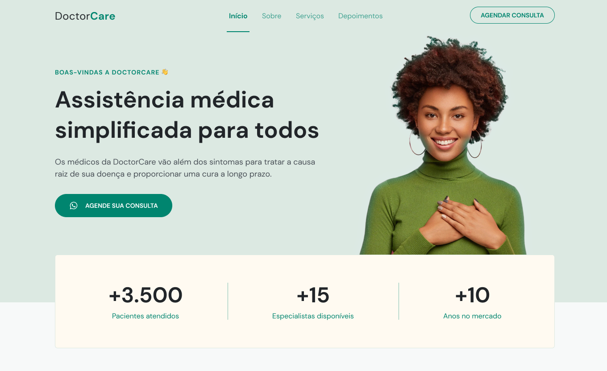

<h1 align="center"> DoctorCare </h1>

A project developed during the Next Level Week 8 with RocketSeat. Made for a fictional healthcare stablishment.  

  <a href="#-tecnologias">Tecnologias</a>&nbsp;&nbsp;&nbsp;|&nbsp;&nbsp;&nbsp;
  <a href="#-layout">Layout</a>

 

  

## 🚀 Technologies

This project was developed with the following technologies:

- HTML, CSS and JavaScript
- Git and Github
- Figma

## 🔖 Layout

You can check the project's layout through [THIS LINK](https://www.figma.com/community/file/1102912263666619803). It's necessary a [Figma](https://figma.com) account to access it.
